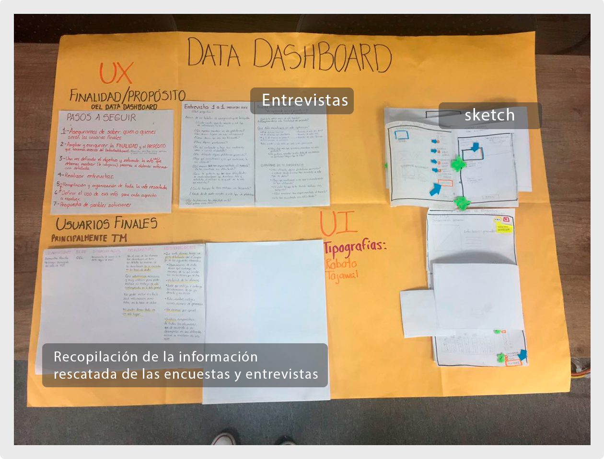
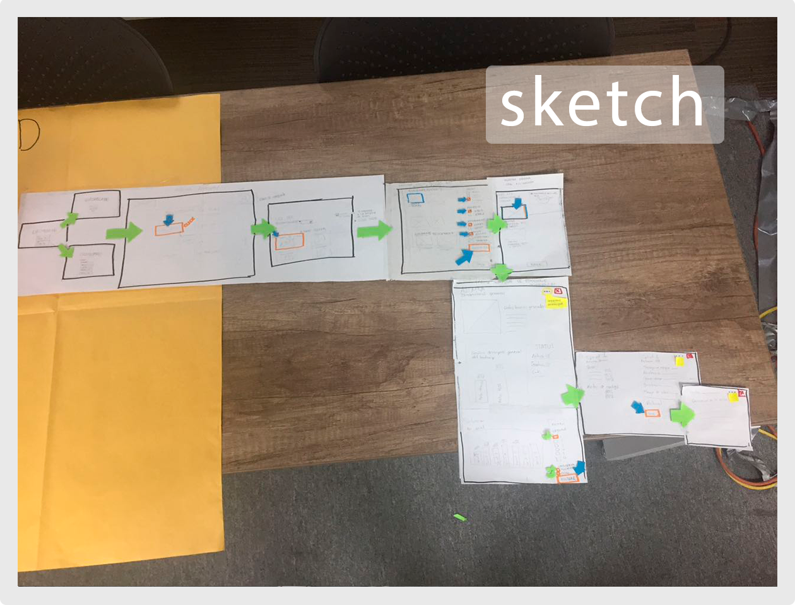
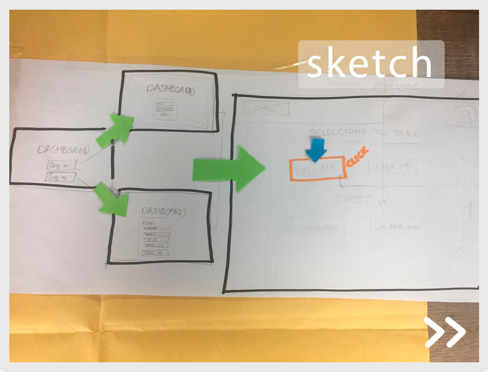
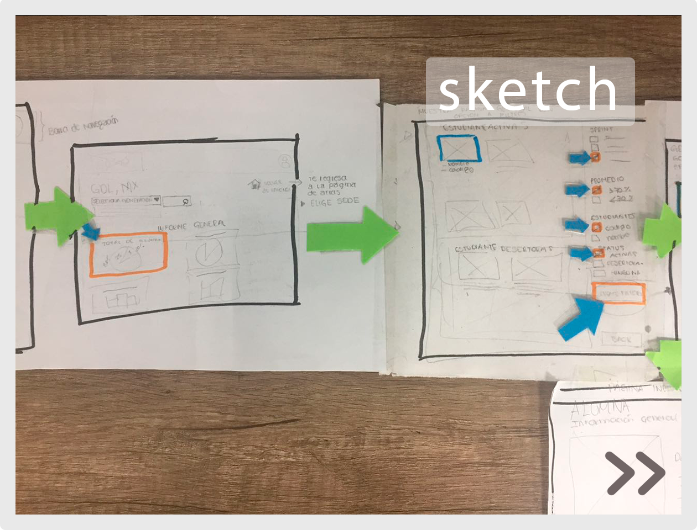
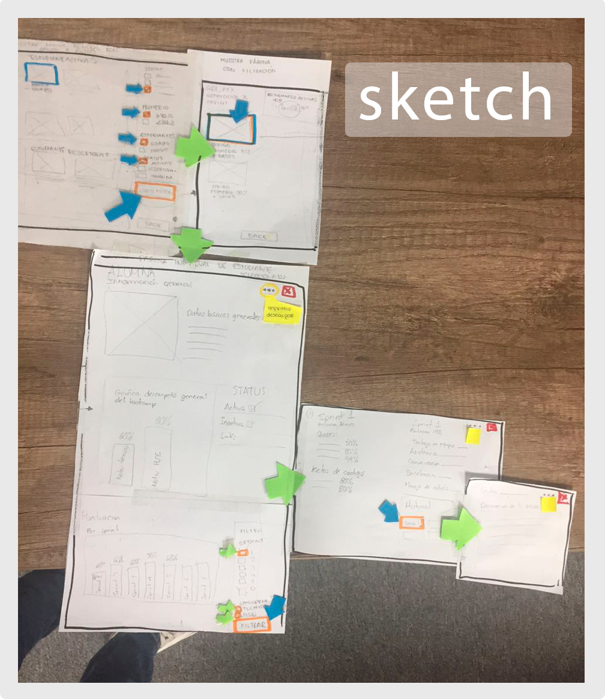

# Data Dashboard

* **Integrantes del equipo:** _Claudia Trujillo, Ambar de Alejandría_
* **Curso:** _Creando tu primer sitio web interactivo_
* **Unidad:** _Producto final_

***

## Sobre el producto
###### _Información inicial proporcionada por Laboratoria_

En Laboratoria, las Training Managers (TMs) hacen un gran trabajo al analizar la mayor cantidad de datos posibles respecto al desempeño de las estudiantes para apoyarlas en su aprendizaje. Para revisar esta data, las TMs, normalmente, tienen que revisar muchos documentos de excel (Google Spreadsheets) que están localizados en distintas carpetas y ubicaciones. Muchas veces pierden tiempo localizando estos documentos y ejecutando fórmulas para obtener los datos que necesitan.

## Objetivo del producto
###### _Información inicial proporcionada por Laboratoria_

Para poder optimizar el tiempo de las TMs se construirá una herramienta web donde puedan ver estos datos fácil y rápidamente.
##### Data a la que se podrá acceder desde este producto:
- El total de estudiantes presentes por sede y generación.
- El porcentaje de deserción de estudiantes.
- La cantidad de estudiantes que superan la meta de puntos en promedio de todos los sprints cursados. La meta de puntos es 70% del total de puntos en HSE y en tech.
- El porcentaje que representa el dato anterior en relación al total de estudiantes.
- El Net Promoter Score (NPS) promedio de los sprints cursados.
- La cantidad y el porcentaje que representa el total de estudiantes que superan la meta de puntos técnicos en promedio y por sprint.
- La cantidad y el porcentaje que representa el total de estudiantes que superan la meta de puntos de HSE en promedio y por sprint.
- El porcentaje de estudiantes satisfechas con la experiencia de Laboratoria.
- La puntuación promedio de l@s profesores.
- La puntuación promedio de l@s jedi masters.
-----

## Flujo de Trabajo
###### _En esta sección presentamos el flujo de trabajo que seguimos para poder realizar este reto. La realización de este flujo tuvo el objetivo de fijar una dirección clara en nuestras actividades a la vez que nos permitió tener una mejor organización para realizarlas._


El flujo se divide en las siguientes etapas:

#### Investigación:
- Revisión de los requerimientos.
- Documentación de metodologías de UX para entrevistas.
- Investigación sobre los usuarios finales.
- Creación de preguntas para UX del producto.
- Realización de entrevistas presenciales.
- Encuestas a las Training Managers vía online.
- Recopilación y organización de la información rescatada.
- Análisis de la información.
- Entendimiento del problema desde el punto del
- Realización de hipótesis.

#### Ideación:
- Realización de propuestas de posibles soluciones al problema considerando los requerimientos.

#### Sketching & Prototyping:

- Generación de historia de usuario.
- Realización de la hipótesis de cómo el producto creado resolverá las necesidades de las TM.
- Creación y diseño del sketch del flujo de la aplicación.

```
Evidencias
```


---

---

---

---
    

------

## Justificación
###### _Obtenida en base a la investigación realizada_
El no poder acceder a toda la data necesaria desde un mismo lugar repercute considerablemente en el **_tiempo_** que las TMS invierten en cada búsqueda. Ya que para actualizarla, compararla, verificarla  y obtener un estatus general de la misma, tienen que recurrir a varios archivos (de navegación no amigable), lo cual resta agilidad a dichos procesos y atrasa evaluaciones, decisiones y resultados de las propias actividades y de otras más, directa e indirectamente relacionadas. Derivando también en un estado emocional inadecuado y desfavorecedor en las TMS repercutiendo en su bienestar y en su desempeño.


## Hipótesis


Si se desarrolla una aplicación web que **_centralice_** toda la data que las _Training Managers_ necesitan, utilizando una estructura que permita acceder a ella a través de **_diferentes filtros_** intuitivos  que obedezcan a las necesidades y patrones del usuario,  y a la vez presente los resultados de dichos filtros en una visión general y en una particular valiéndose de distintos recursos gráficos que faciliten la lectura; y además permita la actualización sistematizada y automática de la data. Entonces las _Training Managers_ y el equipo de formación de **Laboratoria** podrán acceder y visualizar estos datos **fácil** y **rápidamente**.

---
## Versiones

- `VERSIÓN 1.0` -
Buscará satisfacer las necesidades de las Training Managers. (Consulte la _Hipótesis_).

- `VERSIÓN 1.1` -
Buscará satisfacer las necesidades de las Training Managers y las del equipo de formación:

  _Algunas necesidades del equipo de formación:_
  - Información sobre qué alumnas entregan o no, links de trabajos.
  - Historial de HSE por alumna, etc.

  Con el fin de mejorar y agilizar las evaluaciones.

- `VERSIÓN 1.2` -
Buscará satisfacer las necesidades de las Training Managers y del equipo de formación. Además la aplicación mostrará un apartado especial al que podrán acceder las estudiantes de Laboratoria, con el fin de que puedan consultar la información correspondiente a sus evaluaciones.


-------

## Historia de usuario


--
Mayra es una mujer que se desempeña como training manager de Laboratoria en la sede de Monterrey, México. Para desempeñar su función necesita acceder a información relacionada a las estudiantes que aprenden en dicha institución y de las cuales está a cargo. Con dicha información interpreta resultados, realiza evaluaciones, y toma desiciones. Estos procesos los realiza todos los días para poder trabajar de manera óptima, e invierte aproximadamente dos días a la semana para actualizar data.
A Mayra le encanta su trabajo, pero generalmente se siente muy frustada porque invierte mucho tiempo tratando de encontrar la información que necesita, la cual está localizada en muchas bases de datos (de navegación no amigable) y en archivos diferentes. A pesar de que Mayra se ha acostumbrado a esta forma de acceder a la información, desearía encontrar una herramienta que le permitiera tener toda la información en un solo lugar, y que además la representación de los datos fuera de manera gráfica para hacer más fácil la lectura y el análisis.

Si existiera esta herramienta, Mayra cree que podría agilizar su trabajo, sentirse más relajada y con menos estrés al realizar esta parte tan esencial de su trabajo, ya que optimizaría su tiempo y podría invertirlo en otras actividades que son también importantes para ella.


## Sketch del flujo de la aplicación

link
